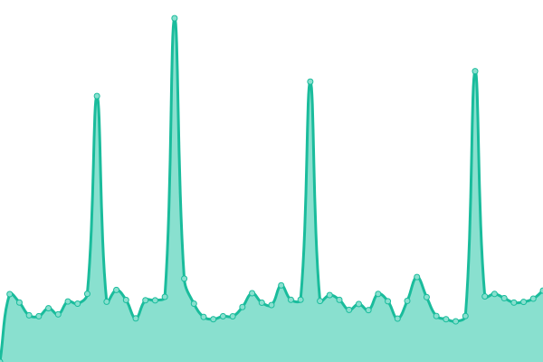
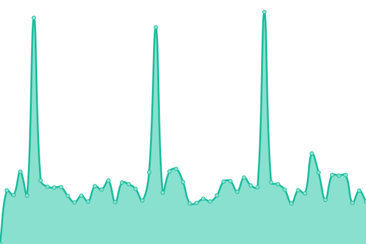
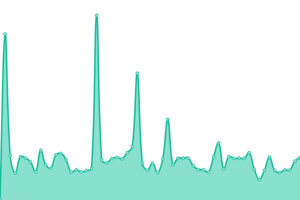
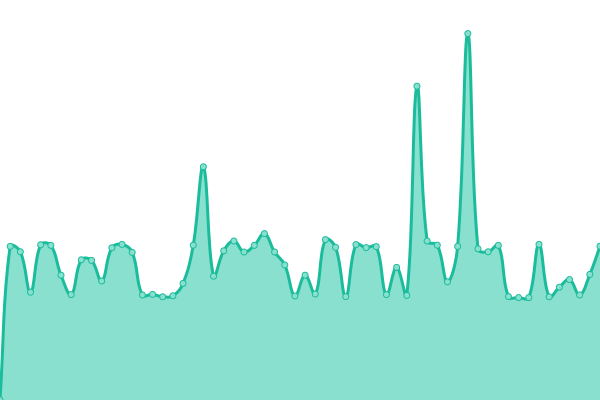

# [📈 Live Status](https://status.phpbb-fr.com): <!--live status--> **🟩 All systems operational**

This repository contains the open-source uptime monitor and status page for [phpBB-fr](https://www.phpbb-fr.com), powered by [Upptime](https://github.com/upptime/upptime).

With [Upptime](https://upptime.js.org), you can get your own unlimited and free uptime monitor and status page, powered entirely by a GitHub repository. We use [Issues](https://github.com/phpbb-fr-com/status-site/issues) as incident reports, [Actions](https://github.com/phpbb-fr-com/status-site/actions) as uptime monitors, and [Pages](https://status.phpbb-fr.com) for the status page.

<!--start: status pages-->
<!-- This summary is generated by Upptime (https://github.com/upptime/upptime) -->
<!-- Do not edit this manually, your changes will be overwritten -->
<!-- prettier-ignore -->
| URL | Status | History | Response Time | Uptime |
| --- | ------ | ------- | ------------- | ------ |
|  [phpBB-fr.com](https://www.phpbb-fr.com) | 🟩 Up | [php-bb-fr-com.yml](https://github.com/phpbb-fr-com/status-site/commits/HEAD/history/php-bb-fr-com.yml) | 

 1200ms
     
 | 

<a href="https://status.phpbb-fr.com/history/php-bb-fr-com">40.37%</a>
    

|  [Forum de démonstration](https://demo.phpbb-fr.com) | 🟩 Up | [forum-de-demonstration.yml](https://github.com/phpbb-fr-com/status-site/commits/HEAD/history/forum-de-demonstration.yml) | 

 1459ms
     
 | 

<a href="https://status.phpbb-fr.com/history/forum-de-demonstration">40.61%</a>
    

|  [Base de connaissance](http://forum.phpbb-fr.com) | 🟩 Up | [base-de-connaissance.yml](https://github.com/phpbb-fr-com/status-site/commits/HEAD/history/base-de-connaissance.yml) | 

 1976ms
     
 | 

<a href="https://status.phpbb-fr.com/history/base-de-connaissance">40.85%</a>
    

|  [phpBB-fr DNS 1](51.254.27.129) | 🟩 Up | [php-bb-fr-dns-1.yml](https://github.com/phpbb-fr-com/status-site/commits/HEAD/history/php-bb-fr-dns-1.yml) | 

 677ms
     
 | 

<a href="https://status.phpbb-fr.com/history/php-bb-fr-dns-1">41.10%</a>
    

<!--end: status pages-->

[**Visit our status website →**](https://status.phpbb-fr.com)

## 📄 License

- Powered by: [Upptime](https://github.com/upptime/upptime)
- Code: [MIT](./LICENSE) © [phpBB-fr](https://www.phpbb-fr.com)
- Data in the `./history` directory: [Open Database License](https://opendatacommons.org/licenses/odbl/1-0/)
